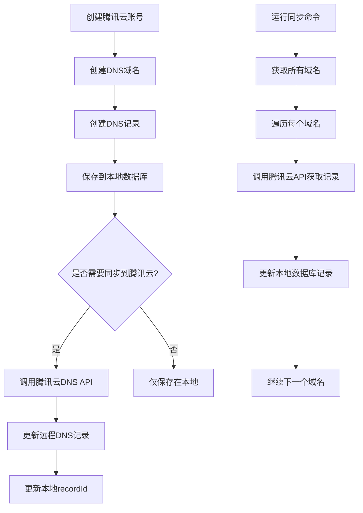
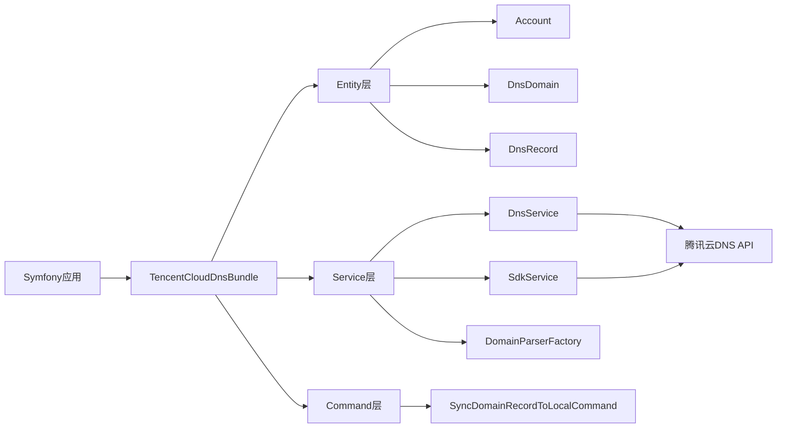
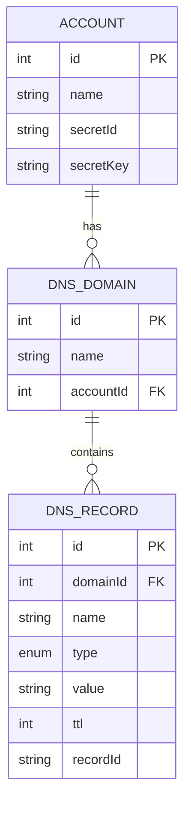
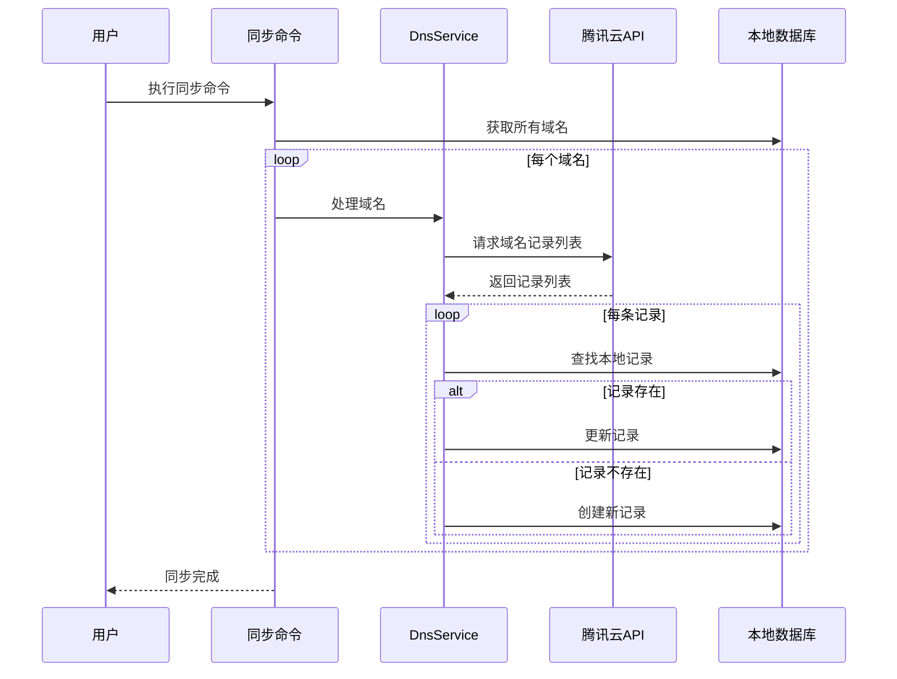

# 腾讯云DNS Bundle工作流程

本文档使用Mermaid图表展示腾讯云DNS Bundle的主要工作流程。

## DNS记录管理流程

```mermaid
graph TD
    A[创建腾讯云账号] --> B[创建DNS域名]
    B --> C[创建DNS记录]
    C --> D[保存到本地数据库]
    D --> E{是否需要同步到腾讯云?}
    E -->|是| F[调用腾讯云DNS API]
    F --> G[更新远程DNS记录]
    G --> H[更新本地recordId]
    E -->|否| I[仅保存在本地]
    
    J[运行同步命令] --> K[获取所有域名]
    K --> L[遍历每个域名]
    L --> M[调用腾讯云API获取记录]
    M --> N[更新本地数据库记录]
    N --> O[继续下一个域名]
```

## 系统组件交互

```mermaid
graph LR
    A[Symfony应用] --> B[TencentCloudDnsBundle]
    B --> C[Entity层]
    B --> D[Service层]
    B --> E[Command层]
    
    C --> C1[Account]
    C --> C2[DnsDomain]
    C --> C3[DnsRecord]
    
    D --> D1[DnsService]
    D --> D2[SdkService]
    D --> D3[DomainParserFactory]
    
    E --> E1[SyncDomainRecordToLocalCommand]
    
    D1 --> F[腾讯云DNS API]
    D2 --> F
```

## 数据模型关系

```mermaid
erDiagram
    ACCOUNT ||--o{ DNS_DOMAIN : "has"
    DNS_DOMAIN ||--o{ DNS_RECORD : "contains"
    
    ACCOUNT {
        int id PK
        string name
        string secretId
        string secretKey
    }
    
    DNS_DOMAIN {
        int id PK
        string name
        int accountId FK
    }
    
    DNS_RECORD {
        int id PK
        int domainId FK
        string name
        enum type
        string value
        int ttl
        string recordId
    }
```

## 同步命令执行流程

```mermaid
sequenceDiagram
    participant User as 用户
    participant Command as 同步命令
    participant Service as DnsService
    participant API as 腾讯云API
    participant DB as 本地数据库
    
    User->>Command: 执行同步命令
    Command->>DB: 获取所有域名
    loop 每个域名
        Command->>Service: 处理域名
        Service->>API: 请求域名记录列表
        API-->>Service: 返回记录列表
        loop 每条记录
            Service->>DB: 查找本地记录
            alt 记录存在
                Service->>DB: 更新记录
            else 记录不存在
                Service->>DB: 创建新记录
            end
        end
    end
    Command-->>User: 同步完成
```

这些图表展示了腾讯云DNS Bundle的主要工作流程、组件交互、数据模型关系以及同步命令的执行流程，帮助开发者更好地理解和使用这个Bundle。
